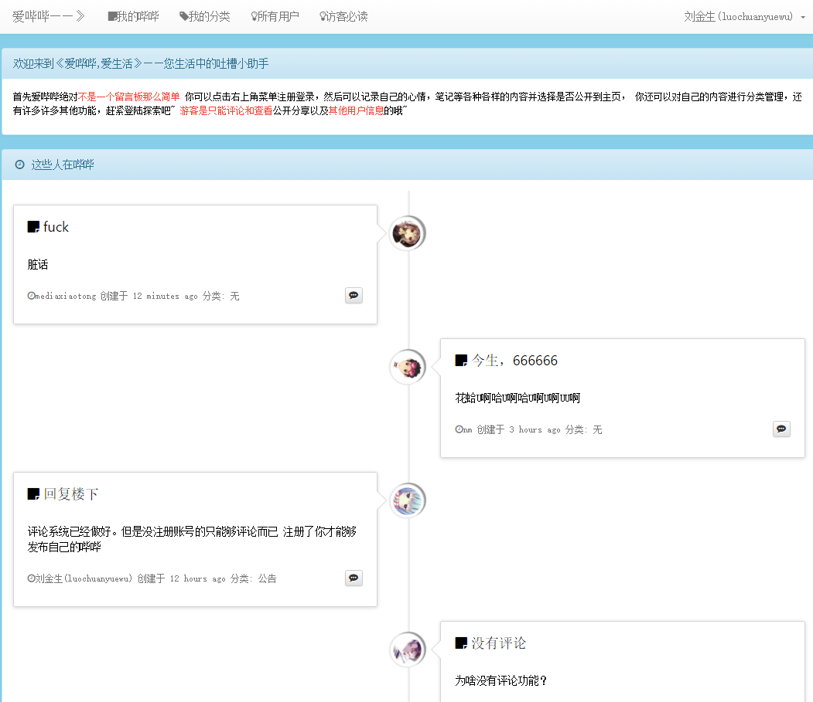
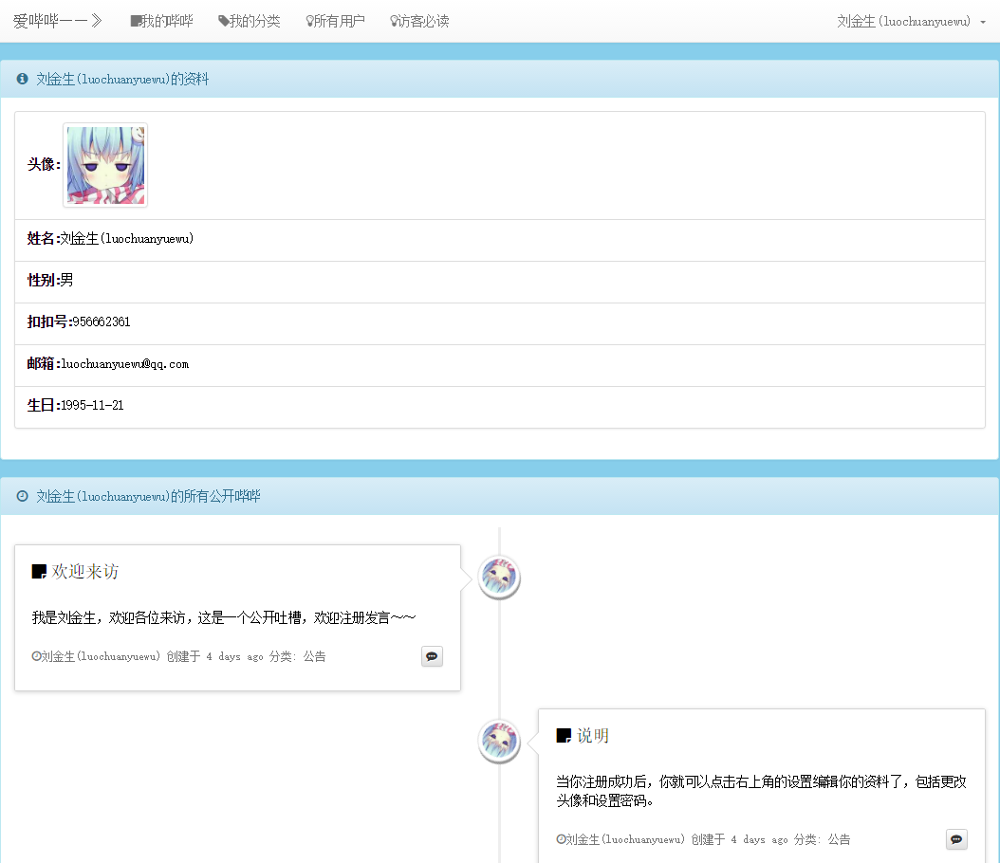
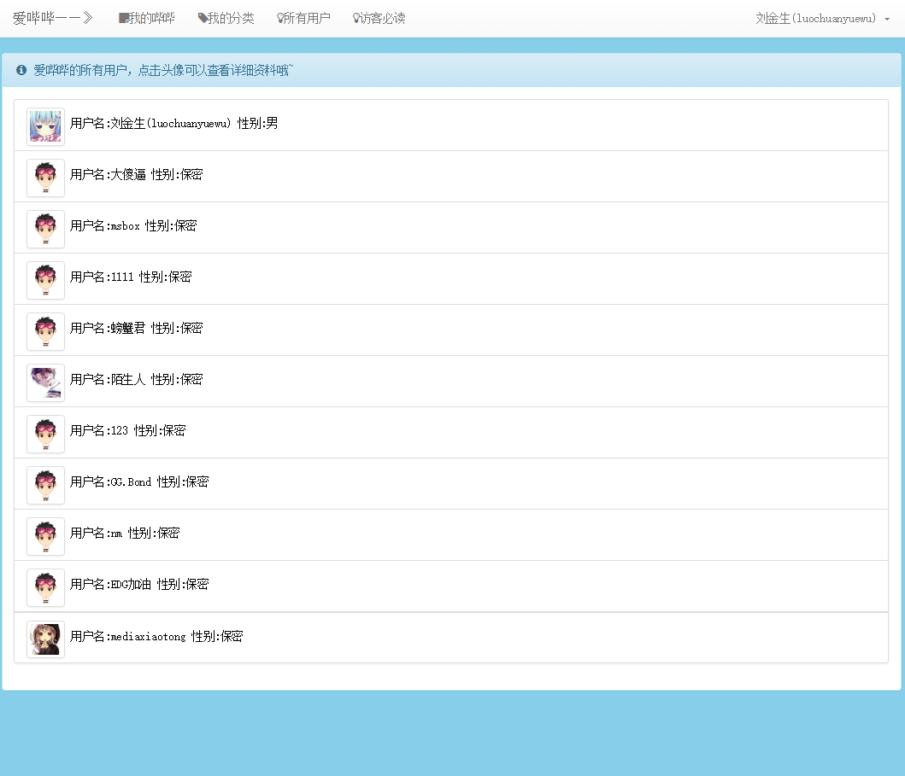

# BiBiNote
BiBiNote是一个类似微博的帖子记录分享网站。

用户登录注册后可以发表帖子,并设置是否公开,可以设置分类查看自己的帖子,并对自己对帖子进行增删改查
管理,公开的帖子所有游客都能看到。

用途:可以用于记录笔记,或者心情分享以及无聊吐槽

##工程预览

## 安装指南
工程使用Laravel 5.2制作并运行于php环境,所以确保你对电脑上安装了composer。

1.克隆此仓库到本地

2.cd到工程根目录,命令行下执行composer install。

3.在你的数据库服务器里创建好用于此工程使用的数据库，比如BiBiNote

4.将.env.example命名为.env并在此文件中配置好数据库名以及数据库用户名对和密码。

5.数据库迁移,执行php artisan migrate即可将所有数据库迁移生成到你制定对数据库中。

6.在apache里新建一个虚拟主机，文档根目录指向工程根目录下的public目录。

7.然后你就有了自己的BiBiNote系统了。

## 一起参与

欢迎各位共同参与此项目的开发

我的官网是: luochuanyuewu.com

我的邮箱是: luochuanyuewu@gmail.com

## 许可

BiBiNote处于 [MIT license](http://opensource.org/licenses/MIT)协议之下。
